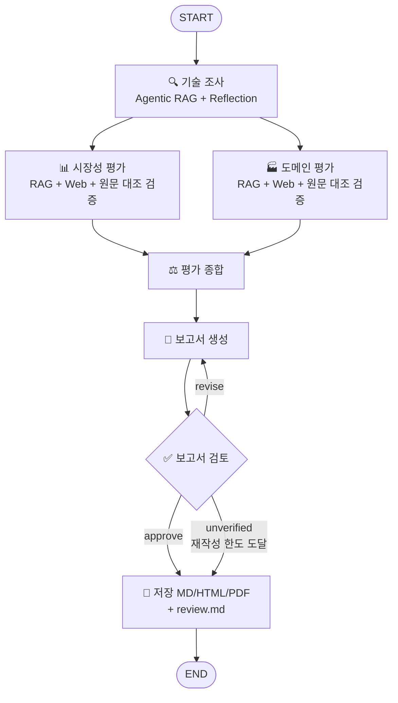
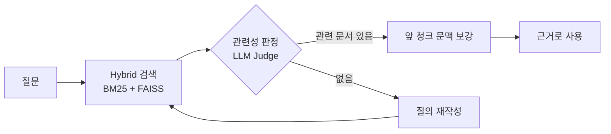

# KV cache 최적화 기술 다관점 평가 - SW 압축 vs HW 메모리 확장
본 프로젝트는 KV cache 최적화 기술을 소프트웨어(SW)·하드웨어(HW) 두 진영에서 1건씩 선정하여,
**시장성·도메인 적용** 관점에서 어떻게 다르게 평가되는지 비교하는 평가 보고서를 자동 생성하는
Multi-Agent + Agentic RAG 시스템입니다. 특정 기술을 추천하거나 우열을 판정하지 않고, 관점별로 평가가 어떻게 엇갈리는지를 드러내는 것이 목적입니다.

> 1인 과제 범위 : 기술 선정은 (2안) Human 기반으로 Doc Pool에서 진영별 1건을 직접 선정했고, 평가 관점은 **2. 시장성**과 **4. 도메인 적용**만 다룹니다.


## Overview
- Objective : 하나의 병목(KV cache)을 상반된 방식으로 푸는 두 기술을 시장성·도메인 관점에서 비교 평가
- Method : LangGraph Multi-Agent (병렬 Fan-out/Fan-in + 검토 Loop) + Agentic RAG (검색 → 관련성 판정 → 질의 재작성)
- Tools : LangGraph, LangChain, FAISS, BM25, fastembed(오픈소스 임베딩), Tavily 웹 검색, fpdf2
- Output : `outputs/RAG-Output_판교_6반_권유나.pdf` (평가 보고서, 10페이지 이내)


## Selected Technologies
| 진영 | 기술 | 근거 문서 | 선정 이유 |
|---|---|---|---|
| SW - 데이터를 작게 | **TurboQuant** (Google) | Zandieh et al.(2025), arXiv 2504.19874 | 이미 생성된 KV cache를 사후에 3비트 수준으로 양자화해 기존 GPU/HBM 위에서 SW만으로 적용 가능. 데이터 비의존(online) 방식이라 서빙 시스템 통합이 쉽고, Google Research 발표 이후 산업계 반응 자료가 많아 시장성 근거 확보가 쉬움 |
| HW - 공간을 넓게 | **ITME** (SK hynix) | Jang et al.(2026), arXiv 2606.12556 | KV cache 원본은 그대로 두고 CXL-Hybrid 분리형 메모리로 용량을 확장. 메모리 제조사가 제안한 구조라 CXL 표준·제품화 흐름과 맞닿아 있고, SW 압축과 정반대 접근이라 관점별 대비가 선명함 |

- 평가 도메인 : **데이터센터·클라우드 LLM 서빙** (처리량·지연·TCO에 민감하고 KV cache가 GPU 메모리 병목이 되는 대표 환경)


## Features
- **논문 PDF 기반 정보 추출 (RAG)** : 두 논문(총 38페이지, 제한 200페이지 이내)을 청크 단위로 색인하고, 기술(tech) 메타데이터로 필터링해 해당 기술 논문에서만 검색
- **Agentic RAG** : 검색 결과를 LLM이 관련성 판정 → 관련 문서가 없으면 질의를 재작성해 재검색 → 채택된 청크에는 앞 청크 문맥을 붙여 전달(청크 경계에서 주어가 잘리는 문제 보완)
- **Hybrid Retrieval** : BM25(키워드: CXL, 3-bit, throughput 등 고유 용어) + Dense(의미 유사도)를 Reciprocal Rank Fusion으로 결합
- **평가 기준 명시** : 관점별 기준·등급 루브릭을 코드로 정의(`prompts/criteria.py`)하고 모든 평가를 같은 루브릭으로 판정
- **인용 기반 REFERENCE 자동 생성** : 본문 인용 태그(`[P-SW p.3]`, `[WM2]`)를 번호로 변환하고, **실제로 인용된 자료만** 가이드 형식으로 REFERENCE에 기재
- **수치·출처 검증 (Grounding)**
  - 규칙 검사 : 논문 인용 문장의 수치 토큰을 **정확히 인용한 페이지**와 대조. 단위 없는 소수·한 자리 수·공백 있는 페이지 표기·혼합 웹 인용도 검사 (`agents/grounding.py`). 숫자 존재 검사는 지표·조건 일치를 보장하지 않음.
  - Reflection 검증 : 상위 모델(`gpt-4.1`)이 **인용된 논문 페이지 원문 전체**와 대조해 수치-지표 일치(예: 지연·처리량 수치를 품질 근거로 쓰지 않음), 출처-주장 일치(인접 기술 자료는 '간접 근거'로 표시), 모호한 표현('일부 지원')의 구체화를 검증·수정
  - 평가 기준 정의에서 지표를 명확히 구분 : D3 품질 유지는 정확도 지표만 근거로 인정, KV 값을 바꾸지 않는 구조는 '설계상 손실 요인 없음(측정값 아님)'으로 구분
- **보고서 검토 Loop** : 규칙 검사(목차·SUMMARY 길이·10페이지 제한·우열 표현·수치 근거) + LLM-as-a-Judge(문제 구절 인용, critical/minor 구분) → critical 이 있으면 재작성 (최대 2회)
  - 최종 작성·재작성된 보고서도 원본 PDF에서 추출한 인용 페이지와 수집 웹 발췌문을 전달해 검토. 페이지를 8개까지만 조용히 잘라내지 않으며 누락 근거는 검증 불가로 표시.
  - 재작성 한도에 도달해도 critical 이 남으면 **PDF·HTML·Markdown 본문 상단에 '검토 미통과'를 표시**하고, 잔여 의견을 `outputs/review.md`에 남겨 사람이 확인하도록 함.
- **확증 편향 방지 전략**
  - 웹 검색 질의를 기준마다 "긍정/채택" 질의와 "리스크/비판" 질의로 쌍을 이뤄 수집
  - 평가 스키마에 `supporting_evidence`와 `counter_evidence`를 모두 필수로 두어 반대 근거를 강제로 탐색 (없으면 "확인된 반대 근거 없음" 명시)
  - 논문 수치는 "저자 보고 기준"으로 표기하고 제3자(웹) 평가와 구분, 근거가 부족하면 "판단 유보" 등급 사용
  - 기술 조사 결과를 Reflection 단계로 재검증 : 논문의 비교 대상(baseline)이나 관련 연구의 한계가 대상 기술의 한계로 잘못 기재되지 않았는지 확인
  - 보고서 검토 단계에서 우열 판정·추천 표현을 규칙과 LLM Judge로 이중 점검


## Tech Stack
| Category | Details |
|---|---|
| Framework | LangGraph 1.2, LangChain 1.4, Python 3.11 (uv) |
| LLM / Generator | `gpt-4.1-mini` (조사·평가·종합·보고서 작성) |
| LLM / Judge | `gpt-4.1-mini` (검색 관련성 판정) |
| LLM / Verifier | `gpt-4.1` (기술 개요·평가 결과의 원문 대조 검증, 보고서 검토) |
| Retrieval | FAISS + BM25 Hybrid (RRF) - **Hit Rate@5 0.967, MRR@5 0.917** |
| Embedding | `snowflake/snowflake-arctic-embed-s` (오픈소스, fastembed/ONNX 로컬 추론) |
| Web Search | Tavily |
| Report | Markdown → HTML → PDF (fpdf2) |

### Embedding 모델 선정
리더보드 순위 대신 **실제 문서로 만든 평가셋에서 측정한 결과**로 선정했습니다 (`scripts/eval_retrieval.py`).

- 후보 선정 기준
  - 문서가 영어 논문이므로 영어 검색용 모델
  - 로컬 CPU(Intel Mac)에서 API 비용 없이 돌릴 수 있는 소형(33M 이하 파라미터) ONNX 모델
  - 최대 입력 512 토큰으로 청크(800자, 약 200 토큰)를 자르지 않고 임베딩 가능
- 평가셋 : 기술별 본문 청크 15개씩 무작위 추출 → LLM이 각 청크로만 답할 수 있는 질문을 **바꿔 쓴 표현(paraphrase)**으로 생성 → (질문, 정답 청크 ID) 30쌍

| Retriever | Hit@1 | Hit@3 | Hit@5 | MRR@5 |
|---|---|---|---|---|
| Dense · BAAI/bge-small-en-v1.5 | 0.600 | 0.733 | 0.800 | 0.678 |
| Dense · sentence-transformers/all-MiniLM-L6-v2 | 0.600 | 0.733 | 0.767 | 0.669 |
| Dense · **snowflake/snowflake-arctic-embed-s** | 0.733 | 0.933 | **1.000** | 0.844 |
| Sparse · BM25 | 0.867 | 0.933 | 0.967 | 0.901 |
| **Hybrid · BM25 + arctic-embed-s** (채택) | **0.867** | **0.967** | 0.967 | **0.917** |

- Dense 중 arctic-embed-s가 모든 지표에서 가장 높아 임베딩 모델로 채택
- 해석 시 유의 : 위 수치는 **합성 질문 30개에서 정답 청크를 찾은 비율**이며, 보고서 내용의 정확도를 뜻하지 않는다. 모델 선정과 평가에 같은 질문을 사용했으므로 탐색용 비교 결과로 본다 (보고서 정확도는 위 Grounding 검증과 사람 검토로 별도 관리)
- 기술 논문은 CXL, QJL, Lloyd-Max 같은 고유 용어가 많아 BM25가 강했고, 둘을 결합한 Hybrid가 Hit@1과 MRR이 가장 높아 최종 검색기로 채택. 에이전트가 상위 청크 위주로 근거를 쓰기 때문에 상위 순위 정확도(MRR)를 우선함


## Agents
| Agent | 역할 | RAG | 출력(State key) |
|---|---|---|---|
| 🔍 기술 조사 (`tech_research`) | 논문에서 핵심 방식·저자 보고 성과·실험 조건·한계 추출 → 원문 대조 검증 | O | `tech_profiles` |
| 📊 시장성 평가 (`market_evaluation`) | M1 시장 규모·성장성 / M2 상용화·채택 / M3 생태계 지지 평가 (웹 중심 + 논문으로 구현 수준 확인) → 원문 대조 검증 | O + Web | `market_eval` |
| 🏭 도메인 평가 (`domain_evaluation`) | 데이터센터·클라우드 서빙 기준 D1 비용 효율 / D2 처리량·지연 / D3 품질 유지 / D4 도입 용이성 평가 (논문 실험 중심 + 웹 보강) → 원문 대조 검증 | O + Web | `domain_eval` |
| ⚖️ 평가 종합 (`synthesis`) | 관점 간 일치·상충 지점, 두 기술의 인식 차이, 보완 가능성 도출 | X | `synthesis` |
| 📝 보고서 생성 (`report_writer`) | 목차에 맞춰 보고서 작성, 인용 번호화·REFERENCE 생성 | X | `report_md` |
| ✅ 보고서 검토 (`reviewer`) | 규칙 검사(수치-원문 대조 포함) + LLM-as-a-Judge, 재작성·미통과 여부 결정 | X | `review` |
| 💾 저장 (`exporter`) | MD / HTML / PDF 및 중간 결과 저장 | X | `outputs` |

### 평가 기준 (등급 : 높음 / 중간 / 낮음 / 판단 유보, 높을수록 해당 관점에서 유리하게 인식됨)
| 관점 | ID | 기준 | 평가 대상 |
|---|---|---|---|
| 시장성 | M1 | 시장 규모·성장성 | 기술이 속한 시장(LLM 추론 최적화 SW / CXL 메모리 확장)의 규모와 성장 전망 |
| 시장성 | M2 | 상용화·채택 현황 | 제품 출시, 서비스 도입, 오픈소스 통합 사례 |
| 시장성 | M3 | 생태계 지지 | 지원 프레임워크(vLLM, SGLang, TensorRT-LLM), 표준화, 벤더 참여 |
| 도메인 | D1 | 비용 효율 (TCO) | 같은 워크로드에 필요한 GPU·메모리 비용 절감 여지 |
| 도메인 | D2 | 처리량·지연 | 대규모 동시 요청 환경의 throughput, latency, SLO 영향 |
| 도메인 | D3 | 품질 유지 | 정확도·출력 품질 손실 위험 (정확도 지표만 인정, 지연·처리량 수치는 제외) |
| 도메인 | D4 | 도입 용이성 | 기존 GPU 클러스터·서빙 스택 호환성, 추가 하드웨어, 운영 복잡도 |

기준별 등급 루브릭은 [`prompts/criteria.py`](prompts/criteria.py)에 정의되어 있습니다.


## Architecture


Agentic RAG (각 평가 에이전트 내부) :


### State
| Key | Type | 작성 노드 | 설명 |
|---|---|---|---|
| `technologies` | dict | 입력 | 평가 대상 기술 2건 (이름, 진영, 논문, 선정 사유) |
| `domain` | dict | 입력 | 평가 도메인 |
| `tech_profiles` | dict | tech_research | 기술별 개요 (핵심 방식, 저자 보고 성과, 한계, 도입 조건) |
| `market_eval` | dict | market_evaluation | 기술별 시장성 평가 (기준별 등급·지지/반대 근거·신뢰도) |
| `domain_eval` | dict | domain_evaluation | 기술별 도메인 평가 |
| `synthesis` | dict | synthesis | 일치·상충 지점, 인식 차이, 보완 가능성 |
| `report_md` | str | report_writer | 인용·REFERENCE가 반영된 보고서 |
| `review` | dict | reviewer | 통과 여부, critical / minor 수정 지시, PDF 페이지 수 |
| `revision_count` | int | report_writer | 재작성 횟수 (Loop 종료 조건) |
| `sources` | list (reducer: add) | 조사·평가 노드 | 인용 가능한 출처 레지스트리 (논문 + 웹) |
| `trace` | list (reducer: add) | 조사·평가 노드 | RAG 검색·판정·재작성 로그 |
| `outputs` | dict | exporter | 산출물 경로 |

병렬로 실행되는 두 평가 에이전트는 결과를 서로 다른 키(`market_eval` / `domain_eval`)에 쓰고, 함께 추가하는 `sources`, `trace`는 reducer로 누적해 동시 갱신 충돌을 막았습니다. 웹 출처 ID도 노드별 prefix(`WM`, `WD`)로 분리했습니다.


## Directory Structure
```
├── app.py                  # 실행 스크립트 (논문 준비 → 인덱스 → 그래프 실행 → 보고서 저장)
├── graph.py                # LangGraph 워크플로 정의
├── state.py                # Graph State 정의
├── config.py               # 대상 기술·도메인·모델·RAG 설정
├── llm.py                  # LLM 생성 헬퍼
├── agents/                 # Agent 모듈
│   ├── tech_research.py    #   기술 조사 (RAG + Reflection)
│   ├── perspective.py      #   시장성 / 도메인 평가 (RAG + Web)
│   ├── synthesis.py        #   평가 종합
│   ├── report_writer.py    #   보고서 생성 + REFERENCE 자동화
│   ├── reviewer.py         #   보고서 검토 (규칙 + LLM Judge)
│   ├── grounding.py        #   수치-원문 대조 검사
│   ├── exporter.py         #   MD / HTML / PDF 저장
│   ├── schemas.py          #   구조화 출력 스키마
│   └── common.py           #   병렬 실행, 웹 출처 레지스트리
├── rag/                    # RAG 파이프라인
│   ├── ingest.py           #   PDF 로드 → 분할 → 임베딩 → FAISS
│   ├── embeddings.py       #   오픈소스 임베딩 (fastembed)
│   ├── retriever.py        #   Hybrid Retriever (BM25 + FAISS, RRF)
│   └── agentic.py          #   검색 → 관련성 판정 → 질의 재작성
├── prompts/                # 프롬프트 템플릿, 평가 기준
├── tools/web_search.py     # Tavily 웹 검색
├── report/pdf.py           # Markdown → PDF
├── scripts/
│   ├── download_papers.py  # Doc Pool 논문 다운로드 (arXiv)
│   └── eval_retrieval.py   # 임베딩·검색기 평가 (Hit Rate@K, MRR)
├── data/                   # 논문 PDF·인덱스 (git 제외, 실행 시 자동 생성) / eval/qa.json 평가셋
└── outputs/                # 평가 보고서(PDF/MD/HTML), 검색 평가 결과, 중간 결과(run_state.json)
```


## Usage
```bash
# 1. 패키지 설치 (Python 3.11, uv)
uv sync

# 2. API Key 설정 : .env.example 을 복사해 OPENAI_API_KEY, TAVILY_API_KEY 입력
cp .env.example .env

# 3. (선택) 임베딩·검색기 평가
uv run python scripts/eval_retrieval.py

# 4. 보고서 생성 (논문 다운로드·인덱싱 자동 수행)
uv run python app.py --pdf-name "RAG-Output_판교_6반_권유나.pdf"
```
- 결과 : `outputs/` 에 PDF / Markdown / HTML 보고서, `review.md`(자동 검토 결과·잔여 의견), `run_state.json`(에이전트별 중간 결과·검색 로그), `graph.mmd`
- 기존 실행은 **미통과**입니다. 이후 코드 회귀 테스트와 보고서 수동 정정을 수행했으며, 현재 보고서는 **수정본 재검증 대기**입니다. `run_state.json`·`run.log`는 수정 전 실행 기록으로 현재 보고서의 검토 결과가 아닙니다. 외부 LLM·웹을 포함한 전체 재실행은 아직 하지 않았습니다.
- 네트워크 없는 회귀 테스트: `.venv/bin/python -B -m unittest discover -s tests -v`
- 한글 PDF 폰트는 macOS의 Arial Unicode를 자동으로 찾습니다. 다른 환경에서는 `.env`에 `PDF_FONT_PATH`를 지정하세요.
- 논문 PDF는 저작권 문제로 저장소에 포함하지 않고, 실행할 때 arXiv에서 내려받습니다.


## Contributors
- 권유나 : 1인 과제 전체 수행 - 평가 기준 정의, Agent·Graph 설계 및 구현, RAG 파이프라인·검색 평가, 프롬프트 엔지니어링, 보고서 생성
